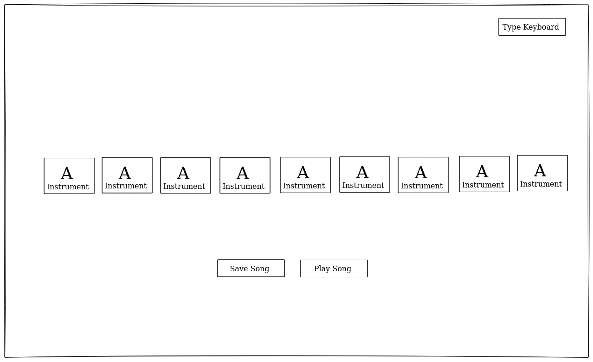

# JavaScript Drum Kit

An interactive website where the user's can play songs with basics instruments

---

## User Story Dependencies

[Story Dependency Diagram](../public/img/users-dependencies.svg)

---

## WIREFRAME

---

## 0.Setup

- [ ] Create repo
- [ ] Add Contributors
- [ ] Set up Project Board
- [ ] Start README
- [ ] Turn on GitHub Pages

---

## X. Story Name

- As a user I want to go to go to a site  that i can play with music instruments using the keyboard
  - [ ] _Given any browser when a user navigates to our URL then the site should appear with no errors showing the basics instruments to play_
  - [ ] _Given the user's want to play instrument's the web mus have al least 9 instruments

- As a user I want to play with a single line of the keyboard, so that i can have an order to play
  - [ ] _Given the user's want to play with a single line the the key's must be set to an specific type of keyboard, soo the most used is QWERTY_

- As a user I want to see the keys of the keyboard in the main screen with the type of instrument so that i can know which key's can I press
  - [ ] _Given the user want to see the the keys on the screen the keys must be in the center with a good size to be seen without effort_

- As a user I want to see highlighted the pressed key so that I can know which key i'm pressing
  - [ ] _Given the user want to see the keys highlighted  when  it's pressed  then the border or the background os the screen should change of color_

### REPO

1. This user story is developed on branch `user-story`.
    - This branch is merged to `master` branch after the acceptance criteria have been checked off.

1. This development strategy is developed on branch `development-strategy`.
    - This branch is merged to `master` branch after the acceptance criteria have been checked off.

1. This html is developed on branch `html-drum`.
    - This branch is merged to `master` branch after the acceptance criteria have been checked off.

1. This css is developed on branch `css-drum`.
    - This branch is merged to `master` branch after the acceptance criteria have been checked off.

1. This play-sound handler is developed on branch `play-sound-handler`.
    - This branch is merged to `master` branch after the acceptance criteria have been checked off.

1. This keydown-play listener is developed on branch `key-down-play-listener`.
    - This branch is merged to `master` branch after the acceptance criteria have been checked off.

1. This remove-transition handler is developed on branch `remove-transition-handler`.
    - This branch is merged to `master` branch after the acceptance criteria have been checked off.

1. This remove-transition-time listener is developed on branch `remove-transition-time-listener`.
    - This branch is merged to `master` branch after the acceptance criteria have been checked off.

1. This init.js render module is developed on branch `init-module`.
    - This branch is merged to `master` branch after the acceptance criteria have been checked off.

### Concern A

- `play-sound.js`: Is a handler function that play when a key is pressed.
Assigned to rago89

- `key-down-play`: Is a listener event that when the keys are pressed the sound play.
Assigned to rago89

### Concern B

- `remove-transition`: Is a handler function that reduces the time of the action.
Assigned to rago89

- `remove-transition-time`: Is a listener event that when the keys are pressed and sound play it reduce time of execution of the event.
Assigned to rago89

### Finishing touches

As a perfectionist i want to make sure that everything works well

---

